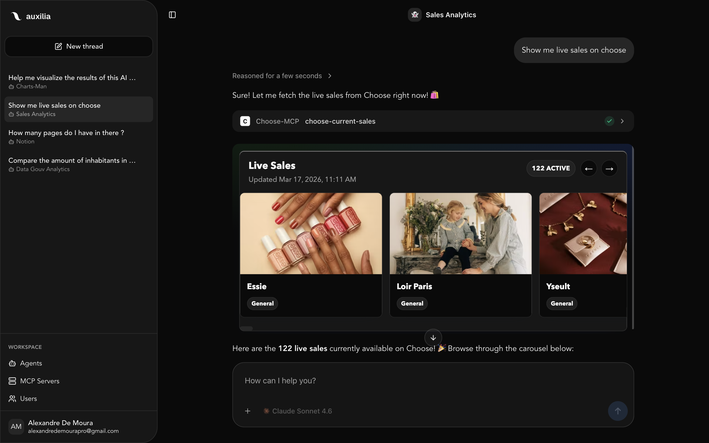

# Choose MCP

An MCP server that fetches live sales from [Choose](https://appchoose.io) and renders an interactive carousel as a UI resource. It exposes a tool that returns both a structured JSON summary for the model and a React-powered carousel visualization for the client.

## Tools

| Tool | Description |
|------|-------------|
| `choose-current-sales` | Fetches live sales and renders an interactive carousel with images, names, and categories |

The tool returns normalized sale data (id, name, image, categories) along with an interactive card carousel that supports navigation, loading shimmer states, and error handling.

## Example



## Local Installation

```bash
git clone <repo-url>
cd Choose-MCP
npm install
npm run build   # builds the frontend bundle and compiles the server
npm start
```

For development with file watching:

```bash
npm run dev
```

The server runs on `http://127.0.0.1:3001` by default. Set `MCP_PORT` or `MCP_HOST` to change it.

## Using with an MCP Client

Add the server to your MCP client configuration:

```json
{
  "mcpServers": {
    "choose": {
      "url": "http://localhost:3001/mcp"
    }
  }
}
```

The server uses Streamable HTTP transport. Each client connection gets its own isolated session.
